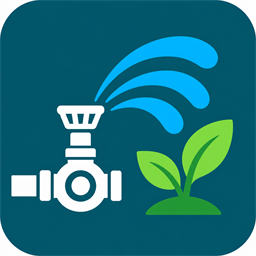
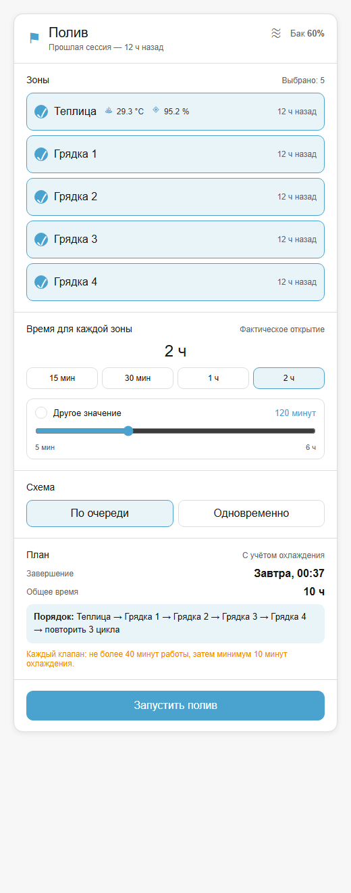
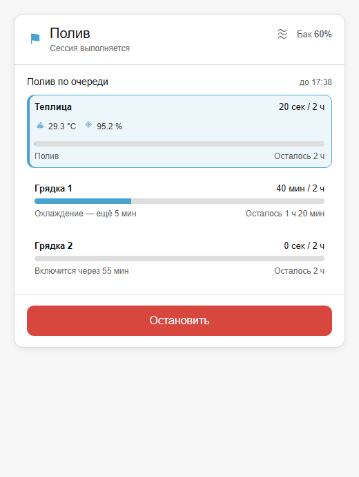

# Fazenda Irrigation

[English](README.md) | **Русский**

<p align="center">
  
</p>

Fazenda Irrigation — компонент ручного управления поливом для Home Assistant.
Пользователь выбирает зоны, фактическое время полива каждой зоны и схему
работы: по очереди или одновременно. Интеграция сама соблюдает режим работы
клапанов и добавляет паузы для охлаждения, не вычитая их из выбранного времени
полива.

Компонент предназначен для случаев, когда полив зависит от сезона, погоды и
того, что сейчас посажено, поэтому запуск понятной разовой сессии удобнее
постоянной перенастройки расписания.

## Возможности

- Любое количество зон в виде сущностей Home Assistant `switch` или `valve`,
  без привязки к производителю оборудования.
- Последовательный циклический полив для источников со слабым напором или
  одновременная работа зон.
- Настраиваемое максимальное время непрерывной работы клапана и обязательное
  охлаждение. Тепловое состояние сохраняется между остановками, сессиями и
  перезапусками Home Assistant.
- Настраиваемые кнопки времени и отдельный ползунок произвольной длительности.
- Необязательная блокировка по уровню воды и управление насосом или главным
  клапаном.
- Встроенная карточка Lovelace с выбором зон, расчётом завершения, текущим
  прогрессом и визуальным редактором.
- Настройки карточки для отображаемого бака, набора и порядка зон, двух
  дополнительных датчиков на зону, кнопок времени и диапазона ползунка.
- Действия Home Assistant для автоматизаций. YAML для настройки интеграции не
  требуется.

## Внешний вид карточки

### Полив не запущен

<p align="center">
  
</p>

### Полив выполняется

<p align="center">
  
</p>

Fazenda Irrigation не рассчитывает потребность в воде по погоде или влажности
почвы и не создаёт регулярное расписание. Для таких сценариев лучше подходят
[Irrigation Unlimited](https://github.com/rgc99/irrigation_unlimited),
[Smart Irrigation](https://github.com/altmenorg/HAsmartirrigation) или
[IrrigationProgram](https://github.com/petergridge/Irrigation-V5).

## Установка через HACS

[](https://my.home-assistant.io/redirect/hacs_repository/?owner=Diamond16&repository=fazenda_irrigation&category=integration)

1. В **HACS → Пользовательские репозитории** добавьте
   `https://github.com/Diamond16/fazenda_irrigation` с типом **Интеграция**.
2. Откройте **Fazenda Irrigation**, нажмите **Скачать** и перезапустите Home
   Assistant.
3. Откройте **Настройки → Устройства и службы → Добавить интеграцию**, найдите
   **Fazenda Irrigation** и создайте контроллер.

Карточка регистрируется самой интеграцией. Добавлять JavaScript-ресурс Lovelace
вручную не нужно. Ручная установка, обновление и удаление описаны в
[инструкции по установке](docs/installation.md).

## Настройка контроллера

Выберите сущности зон и укажите:

- набор быстрых времён и допустимый диапазон произвольной длительности;
- схему полива по умолчанию;
- максимальное время непрерывной работы клапана и время охлаждения;
- при необходимости датчик уровня бака и минимальный уровень;
- при необходимости насос или главный клапан и задержку после его включения.

По умолчанию используются кнопки 15, 30, 60 и 120 минут, диапазон 5–360 минут с
шагом 5 минут, последовательная схема, 40 минут непрерывной работы и 10 минут
охлаждения. Замените ограничения клапана на значения, подходящие для вашего
оборудования.

Все параметры контроллера и карточки перечислены в
[описании настройки](docs/configuration.md).

## Добавление карточки

Добавьте **Fazenda Irrigation** через редактор панели Home Assistant. Основные
параметры доступны в визуальном редакторе. Эквивалентная YAML-конфигурация:

```yaml
type: custom:fazenda-irrigation-card
title: Полив
tank_entity: sensor.irrigation_tank_level
zones:
  - switch.greenhouse_irrigation
  - valve.bed_1
zone_sensors:
  switch.greenhouse_irrigation:
    - sensor.greenhouse_temperature
    - sensor.greenhouse_humidity
duration_presets: [15, 30, 60, 120]
custom_duration_min: 5
custom_duration_max: 360
custom_duration_step: 5
```

Карточка находит контроллер автоматически. При первом открытии выбраны все
видимые зоны. Далее выбор зон и схема полива сохраняются отдельно в каждом
браузере или приложении.

Запуск сессии и действия для автоматизаций описаны в
[руководстве по использованию](docs/usage.md). Возможные проблемы собраны в
[разделе диагностики](docs/troubleshooting.md).

## Безопасность

Программное обеспечение не может обнаружить залипшее реле, заблокированный
клапан, повреждённый кабель или команду, которая не дошла до недоступного
устройства. Учёт нагрева охватывает только сессии, запущенные через Fazenda
Irrigation. Прямое управление сущностями зон обходит эту защиту.

Используйте нормально закрытые клапаны, правильно подобранную электрическую
защиту и независимые средства безопасности, необходимые для вашей установки.
Перед использованием без присмотра проверьте остановку и восстановление после
перезапуска в присутствии человека.

## Разработка

```bash
python -m unittest discover -s tests -v
python -m ruff check .
python -m ruff format --check .
python -m compileall -q custom_components/fazenda_irrigation
node tests/test_fazenda_irrigation_card.mjs
```

Правила участия описаны в [CONTRIBUTING.md](CONTRIBUTING.md). Лицензия —
[MIT](LICENSE).
